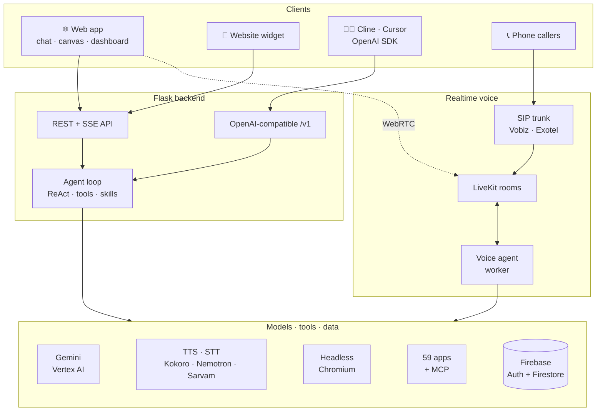

<div align="center">



<br />

**Chat · Deep research · Live canvas · Voice agents on real phone numbers · 59 integrations**
<br />
Self-hostable, OpenAI-compatible, and built for India 🇮🇳

<br />

<a href="LICENSE"></a>


<a href="CONTRIBUTING.md"></a>

<br />

[**Quick start**](#-quick-start) &nbsp;·&nbsp;
[**Features**](#-features) &nbsp;·&nbsp;
[**Architecture**](#-architecture) &nbsp;·&nbsp;
[**Docs**](docs/README.md) &nbsp;·&nbsp;
[**API**](docs/api.md) &nbsp;·&nbsp;
[**Contributing**](CONTRIBUTING.md)

</div>

<br />

<p align="center">
  
</p>

<br />

## ✨ What is Kautilya?

Kautilya AI is a full-stack AI workspace you can run yourself. One login gives you a ChatGPT-style assistant, a live canvas that builds and previews apps, a headless browser the AI can drive, and a studio for **voice agents that answer real phone calls** in Hindi, English and other Indian languages. Every agent can take actions in the tools you already use: HubSpot, Google Workspace, Slack, WhatsApp, Tally, ClearTax GST and 50+ more.

Everything is exposed through an **OpenAI-compatible API**, so the same models work inside Cline, Cursor, Continue, LiteLLM or the OpenAI SDK with one line changed.

> **Named after Chanakya (Kautilya)**, author of the *Arthashastra*, the ancient Indian treatise on strategy and statecraft.

<br />

## 🎬 See it in action

<table>
<tr>
<td width="50%" valign="top">

**🧑‍💻 Build apps in the canvas**<br />
Ask Kautilya Coder for a site and it writes a multi-file project, opens it in the canvas and runs it live. Flip between code and preview, go fullscreen, or download the whole thing as a ZIP.

</td>
<td width="50%" valign="top">

**🎛️ Run voice agents and integrations**<br />
Agent Studio deploys voice and chat agents with their own persona, voice and knowledge base. Connect CRMs, calendars, payments and messaging in one tap. Voice Studio speaks Hindi, English and 7 more Indian languages.

</td>
</tr>
<tr>
<td></td>
<td></td>
</tr>
</table>

<br />

## 🧩 Features

<table>
<tr>
<td width="33%" valign="top">

### 💬 Chat & reasoning
- Four model tiers (**Daily · Pro · Coder · Fast**) on Gemini via Vertex AI, with automatic fallbacks
- Streaming "thinking" and a visible **ReAct** step timeline for every tool call
- **Deep Research** with quick / standard / exhaustive depth and a PRD mode
- **Truth Lens**: a second model family cross-examines each answer and shows a verification badge
- Inline **Mermaid** diagrams and SVG, LaTeX math, rich tables
- Long-term memory, 8 personalities, shareable chats

</td>
<td width="33%" valign="top">

### 🛠️ Build & automate
- **Canvas** for documents, spreadsheets, dashboards, decks and multi-file code with live HTML/React preview
- **Kautilya Computer**: a real headless Chromium the AI browses, clicks and fills forms in, streamed live
- Sandboxed **Python code interpreter** with charts
- Activatable **Skills**: Presentation Architect, Frontend Design, Diagram Architect, Data Visualizer, Research
- Background tasks for long jobs, and **GST invoice** generation

</td>
<td width="33%" valign="top">

### 📞 Voice & telephony
- **LiveKit** realtime voice in the browser, plus Gemini Live
- Voice agents on real numbers through **Vobiz / Exotel SIP** trunks
- Bulk **outbound campaign dialer** with pacing and concurrency
- Leads, call analytics, sentiment and post-call summaries
- TTS: self-hosted **Kokoro**, Sarvam, Cartesia, ElevenLabs
- STT: self-hosted **NVIDIA Nemotron** streaming ASR, Whisper

</td>
</tr>
<tr>
<td valign="top">

### 🤖 Agent Studio
- Voice and chat agents with persona, language, voice and model
- Per-agent **knowledge base** (upload, URL, full-site crawl) with semantic retrieval
- Drop-in **website widget** (one `<script>` tag)
- Lead capture with webhooks to Zapier, Slack or your CRM

</td>
<td valign="top">

### 🔌 Integrations
- **59 providers**: CRM, email, calendar, storage, payments, logistics, HR and more
- An **India business stack**: Tally Prime, Vyapar, ClearTax GST, Gupshup, Zoho
- One-tap OAuth; each family (Google, Microsoft, Zoho) shares one app
- **MCP** client: plug in any Model Context Protocol server
- **KautilyaClaw**: personal agents on Telegram and WhatsApp

</td>
<td valign="top">

### 🧑‍💻 Developer platform
- **OpenAI-compatible** `/v1/chat/completions` and `/v1/models`
- `kautilya-…` API keys with per-tier rate limits
- Works in Cline, Cursor, Continue, LiteLLM, the OpenAI SDK
- Agents, leads, campaigns and research over REST
- Razorpay billing, usage metering, PWA install
- DPDP Act 2023 consent and data-export flows

</td>
</tr>
</table>

<br />

## 🧱 Architecture



Read the full tour, including the request lifecycle, the agent loop and the data model, in [**docs/architecture.md**](docs/architecture.md).

<br />

## 🚀 Quick start

**You need:** Python 3.11, Node.js 20+, a [Firebase](https://console.firebase.google.com) project (Auth + Firestore), and a Google Cloud service account with the **Vertex AI User** role.

```bash
git clone https://github.com/HarshCoder1122/jarvis.git kautilya
cd kautilya
```

**1. Backend** (Flask API on `http://localhost:5000`)

```bash
cd backend
python3.11 -m venv .venv && source .venv/bin/activate
pip install -r requirements.txt
python -m playwright install chromium      # only needed for Kautilya Computer
cp .env.example .env                       # fill in the "Required" block
python app.py
```

**2. Frontend** (React on `http://localhost:3000`)

```bash
cd frontend
npm install --legacy-peer-deps
cp .env.example .env                       # add your Firebase web config
npm run dev
```

Open **http://localhost:3000**, sign in with Google and start chatting. To serve everything from Flask as production does, run `npm run build`. The build is copied into `backend/static/` automatically.

<details>
<summary><b>The minimum <code>.env</code> to boot</b></summary>

<br />

| Variable | Where | What it's for |
|---|---|---|
| `FLASK_SECRET_KEY` | backend | Signs sessions. Generate with `python -c "import secrets;print(secrets.token_hex(32))"` |
| `GOOGLE_VERTEX_CREDENTIALS_JSON` | backend | Service-account JSON (one line). Powers every chat model. |
| `FIREBASE_SERVICE_ACCOUNT_JSON` | backend | Firebase Admin: verifies logins, stores chats in Firestore |
| `REACT_APP_FIREBASE_*` | frontend | Your Firebase web app config (public by design) |
| `REACT_APP_API_URL` | frontend | Backend URL, `http://localhost:5000` locally |

Every other variable switches on an optional feature: voice, telephony, search, billing, email, integrations. Each one is documented in [`backend/.env.example`](backend/.env.example) and [**docs/configuration.md**](docs/configuration.md).

</details>

<br />

## 🔌 Use it as an API

Create a key in **Dashboard → Developer API**, then point any OpenAI client at your backend:

```python
from openai import OpenAI

client = OpenAI(base_url="http://localhost:5000/api/v1", api_key="kautilya-...")

stream = client.chat.completions.create(
    model="kautilya-pro",   # kautilya-daily · kautilya-pro · kautilya-coder · kautilya-fast
    messages=[{"role": "user", "content": "Draft a GST-compliant invoice email for Acme Traders"}],
    stream=True,
)
for chunk in stream:
    print(chunk.choices[0].delta.content or "", end="")
```

```bash
curl http://localhost:5000/api/v1/chat/completions \
  -H "Authorization: Bearer kautilya-..." -H "Content-Type: application/json" \
  -d '{"model": "kautilya-daily", "messages": [{"role": "user", "content": "Namaste!"}]}'
```

For agents, the embeddable widget, leads, campaigns and research endpoints, see [**docs/api.md**](docs/api.md).

<br />

## 🗂️ Repository layout

```text
.
├── backend/                 Flask API, agent loop, voice worker
│   ├── app.py               Entry point: blueprints, CORS, CSP
│   ├── config.py            All env vars and tier limits
│   ├── routes/              27 blueprints: chat, research, agents, telephony, …
│   ├── services/            LLM, agent loop, browser, memory, integrations, …
│   ├── livekit_agent.py     Realtime voice agent worker (LiveKit Agents)
│   ├── campaign_worker.py   Outbound dialer worker
│   └── mcp_config.json      MCP server registry
├── frontend/                React 19 + Tailwind + shadcn/ui
│   ├── src/pages/           Chat, Dashboard, Login, Shared chat
│   ├── src/components/      chat/ (canvas, diagrams, voice) · dashboard/
│   └── server.js            Production server + /api proxy
├── RevealIQ ASR models/     Self-hosted Kokoro TTS engine (FastAPI)
├── voicerecog/              Self-hosted Nemotron streaming STT (FastAPI)
├── kautilyaclaw/            Personal Telegram / WhatsApp agents (OpenClaw)
└── docs/                    Guides, architecture, API reference
```

<br />

## ☁️ Deploy

| Component | Runs as | Guide |
|---|---|---|
| Backend API | Docker (Hugging Face Space, Koyeb, Render, any VM) | [deployment.md#backend](docs/deployment.md#backend) |
| Frontend | Flask-served build, or `node server.js` | [deployment.md#frontend](docs/deployment.md#frontend) |
| Voice agent worker | `livekit_agent.py start` next to LiveKit Cloud | [voice-and-telephony.md](docs/voice-and-telephony.md) |
| TTS / STT engines | Docker Spaces (CPU is enough) | [deployment.md#speech-engines](docs/deployment.md#speech-engines) |
| KautilyaClaw | Docker Compose or HF Space | [kautilyaclaw/README.md](kautilyaclaw/README.md) |

<br />

## 📚 Documentation

| Guide | What's inside |
|---|---|
| 🏁 [Getting started](docs/getting-started.md) | Local setup, step by step, including Firebase and Vertex AI |
| ⚙️ [Configuration](docs/configuration.md) | Every environment variable, grouped by feature |
| 🏗️ [Architecture](docs/architecture.md) | Components, request lifecycle, agent loop, data model |
| ✨ [Features](docs/features.md) | What each part of the product does and how to use it |
| 🔌 [API reference](docs/api.md) | OpenAI-compatible API, agents, embed, leads, campaigns |
| 📞 [Voice & telephony](docs/voice-and-telephony.md) | LiveKit, SIP trunks, the dialer, TTS / STT engines |
| 🧩 [Integrations & MCP](docs/integrations.md) | OAuth setup, the provider catalog, MCP servers |
| ☁️ [Deployment](docs/deployment.md) | Production setup for every component |

<br />

## 🤝 Contributing

Contributions of every size are welcome: bug fixes, new integrations, Indian-language voices, docs and tests. Start with [**CONTRIBUTING.md**](CONTRIBUTING.md) and please follow the [Code of Conduct](CODE_OF_CONDUCT.md).

Found a security issue? Please **don't** open a public issue. See [SECURITY.md](SECURITY.md).

<br />

## 🙏 Built with

[Flask](https://flask.palletsprojects.com) · [React](https://react.dev) · [Tailwind CSS](https://tailwindcss.com) · [shadcn/ui](https://ui.shadcn.com) · [Gemini on Vertex AI](https://cloud.google.com/vertex-ai) · [LiveKit Agents](https://docs.livekit.io/agents) · [Firebase](https://firebase.google.com) · [Playwright](https://playwright.dev) · [Mermaid](https://mermaid.js.org) · [Kokoro TTS](https://huggingface.co/hexgrad/Kokoro-82M) · [NVIDIA Nemotron ASR](https://huggingface.co/nvidia) · [Model Context Protocol](https://modelcontextprotocol.io) · [OpenClaw](https://docs.openclaw.ai)

<br />

<div align="center">

**If Kautilya is useful to you, a ⭐ helps others find it.**


<sub>Released under the <a href="LICENSE">MIT License</a> · Made with ❤️ in India by <a href="https://github.com/HarshCoder1122">Harsh Vardhan</a> and contributors</sub>

</div>
