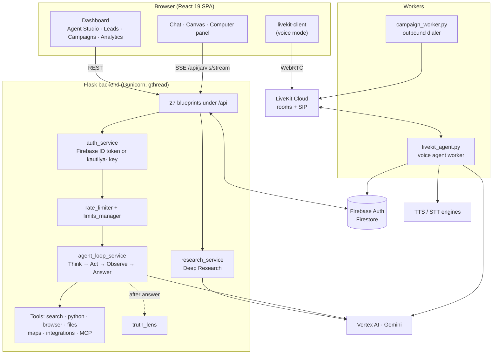
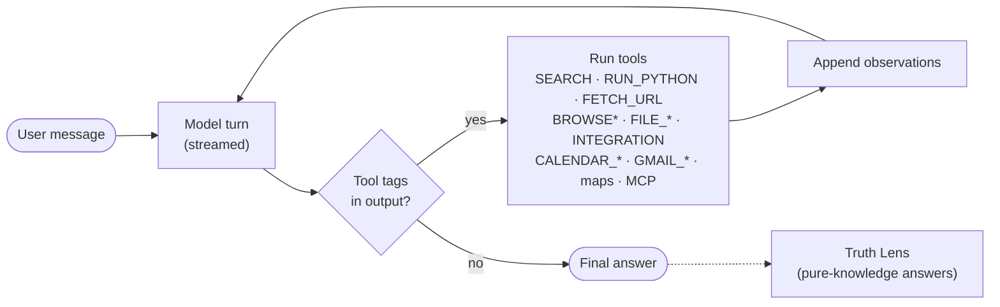
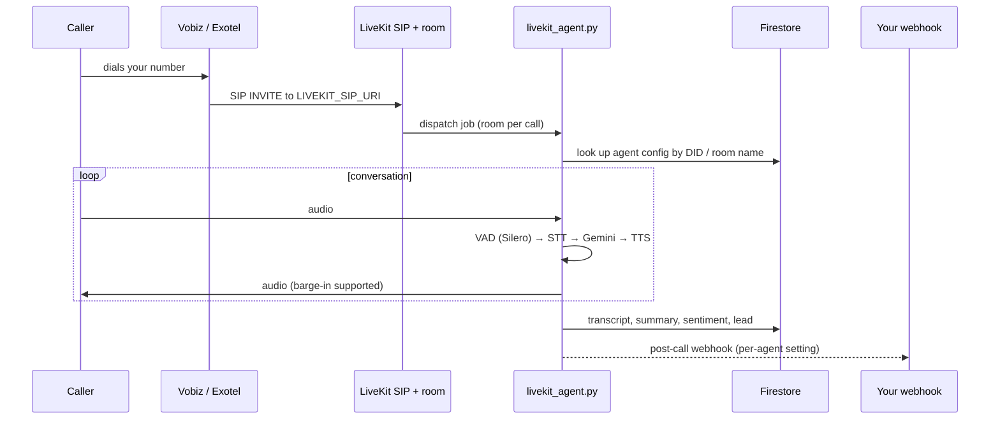

# Architecture

Kautilya is a Flask backend and a React single-page app, backed by Firebase and a set of pluggable model providers. A separate voice worker handles realtime calls. This page explains how the pieces fit together.

## System overview



| Part | Where | Responsibility |
|---|---|---|
| Flask app | `backend/app.py` | Registers blueprints, CORS (pinned origins), CSP, gzip, MCP boot, background schedulers |
| Config | `backend/config.py` | Every environment variable, tier limits, CSP policy |
| Shared singletons | `backend/extensions.py` | Firebase Admin, Firestore client, Razorpay, `LimitManager`, vector store |
| Routes | `backend/routes/` | HTTP surface: chat, research, agents, telephony, billing, integrations… |
| Services | `backend/services/` | Business logic: LLM calls, the agent loop, browser, memory, email, TTS… |
| Voice worker | `backend/livekit_agent.py` | Joins LiveKit rooms and runs STT → LLM → TTS for each call |
| Dialer worker | `backend/campaign_worker.py` | Drains campaign queues and places outbound SIP calls |
| Frontend | `frontend/src/` | Chat (`pages/ChatPage.jsx`), dashboard (`pages/DashboardPage.jsx`), shared chats |
| Speech engines | `RevealIQ ASR models/`, `voicerecog/` | Self-hosted Kokoro TTS and Nemotron STT, OpenAI-compatible |

## Life of a chat message

```mermaid
sequenceDiagram
    autonumber
    participant UI as React (ChatMain)
    participant API as /api/jarvis/stream
    participant Auth as auth_service
    participant Loop as agent_loop
    participant LLM as Gemini (Vertex AI)
    participant Tools as Tools
    participant DB as Firestore

    UI->>API: POST multipart (message, session_id, model, files, skill)<br/>Authorization: Bearer <Firebase ID token>
    API->>Auth: verify token, resolve tier
    API->>API: rate limit (per-minute burst + daily cap)
    API->>DB: save user message, reserve assistant placeholder
    API->>Loop: messages + model tier
    loop until the model stops calling tools
        Loop->>LLM: stream completion
        LLM-->>UI: data: {"thinking": …} / {"chunk": …}
        Loop->>Loop: parse tool tags ([SEARCH: …], [BROWSE: …], …)
        Loop-->>UI: data: {"event": "react_action", …}
        Loop->>Tools: execute
        Tools-->>Loop: observation
        Loop-->>UI: data: {"event": "react_action_done"} / {"event": "tool_result"}
    end
    Loop-->>UI: data: {"event": "truth_lens", verdict}
    API->>DB: persist final answer
    API-->>UI: data: [DONE]
```

The response is **Server-Sent Events** on a normal `fetch` stream. Because the answer is written to Firestore as it streams, a user who closes the tab mid-answer finds it complete when they come back.

### SSE event reference

| Payload | Meaning | UI effect |
|---|---|---|
| `{"chunk": "…"}` | Answer text delta | Appended to the message and rendered as Markdown |
| `{"thinking": "…"}` / `{"thinking_done": true}` | Reasoning trace | Live "Thinking…" block, collapsed into *Process Analysis* afterwards |
| `{"event": "status", "message"}` | Progress note | Shown in the thinking block |
| `{"event": "agent", "agent"}` | Orchestrator routed the request | Agent badge on the message |
| `{"event": "react_action" \| "react_action_done", id, tool, input, status, preview}` | A tool step started or finished | ReAct step timeline |
| `{"event": "react_synthesizing"}` | Tools done, writing the answer | Timeline shows *synthesizing* |
| `{"event": "tool_result", tool, data}` | Structured tool output (emails, events, charts, browser frames) | Result cards; browser frames go to the Computer panel |
| `{"event": "query" \| "sources" \| "artifact"}` | Deep Research queries, citations, final report | Research UI, then the report opens in the canvas |
| `{"event": "truth_lens", verdict, confidence, flags}` | Cross-model verification | Verification badge |
| `{"event": "capacity", upgrade}` | All model lanes saturated | Upgrade card (free tier) |
| `[DONE]` | End of stream | Stops the spinner, refreshes the sidebar |

Multi-file code arrives as `<file name="…">…</file>` blocks, and documents as `<artifact …>` blocks. `frontend/src/lib/artifacts.js` extracts them and opens the canvas.

## The agent loop

`services/agent_loop_service.py` implements a ReAct-style loop. Tools are called with **inline tags** in the model's output rather than provider-specific function calling, so the same loop works with any model.



- **Turn caps:** `AGENT_MAX_TURNS_DEFAULT` (80) and `AGENT_MAX_TURNS_CODER` (200) stop runaway tool chains.
- **Truncation recovery:** when a turn hits the token limit mid-answer, the loop continues it automatically.
- **Guards:** tool arguments that look hallucinated, such as placeholders or truncated JSON, are rejected, and host-filesystem commands are disabled in the cloud build.
- **Skills** (`skills_spec.py`) and **personalities** (`personalities_spec.py`) are prompt overlays chosen per request.
- **MCP tools** are registered at startup from `mcp_config.json` and namespaced `mcp_<server>_<tool>`.

## Voice calls



Browser voice mode uses the same worker: the frontend asks `/api/agents/<id>/livekit-token` for a room token and joins over WebRTC. See [voice-and-telephony.md](voice-and-telephony.md).

## Data model (Firestore)

| Collection | Contents |
|---|---|
| `users/{uid}` | Profile, tier, consent, last seen |
| `users/{uid}/conversations/{session}` + `messages` | Chat history (paginated by `last_updated`) |
| `users/{uid}/settings`, `integrations`, `mcp_servers` | Preferences, connected apps (credentials encrypted per user), custom MCP servers |
| `agents` (+ `kb_files`) | Agent definitions and knowledge-base chunks with embeddings |
| `leads`, `campaigns`, `active_calls`, `call_mappings`, `agent_logs` | Telephony and CRM data |
| `api_keys` | API keys, stored **hashed** (document id = SHA-256 of the key) |
| `api_usage/{uid}/daily`, `usage_logs`, `user_credits` | Metering and pay-as-you-go credits |
| `pro_users`, `processed_payments` | Billing state (idempotent webhook processing) |
| `memories`, `user_memory` | Long-term memory |
| `shared_chats` | Public read-only chat links |
| `background_tasks`, `documents`, `claws`, `claw_hooks` | Long-running jobs, generated documents, KautilyaClaw bots |
| `banned_users`, `config` | Moderation and runtime config |

## Security model

- **Authentication:** every `/api/*` call carries `Authorization: Bearer <token>`. That's either a Firebase ID token (browser) or a `kautilya-…` API key (server-to-server), verified in `services/auth_service.py`.
- **CORS:** pinned to your production origins plus localhost; add more with `ALLOWED_ORIGINS`. Only the embed endpoints are open to any origin.
- **CSP:** a strict Content-Security-Policy is set in `config.py`.
- **Rate limits:** `middleware/rate_limiter.py` applies per-minute bursts and daily caps. Client IPs are resolved in a spoofing-resistant way (`middleware/security.py`).
- **Untrusted model output:** Mermaid runs with `securityLevel: "strict"`, SVG is sanitised with DOMPurify, and HTML previews run in `sandbox`ed iframes without `allow-same-origin`.
- **Secrets:** all credentials come from the environment. See [configuration.md](configuration.md).

## Frontend structure

```text
frontend/src/
├── App.js                 Routing, auth state, token refresh, consent modal
├── pages/                 ChatPage · DashboardPage · LoginPage · SharedChatPage
├── components/
│   ├── chat/              ChatMain (streaming) · ChatMessage (Markdown) · CanvasPane
│   │                      MermaidDiagram · ComputerPanel · LiveKitVoice · ReActSteps …
│   ├── dashboard/         AgentStudio · Integrations · CampaignDialer · CallAnalytics …
│   └── ui/                shadcn/ui primitives (Radix + Tailwind)
└── lib/                   api.js (axios + SSE) · firebase.js · artifacts.js · deck.js
```

`server.js` is an optional Express production server. It serves `build/`, proxies `/api/*` to `BACKEND_URL` (adding `HF_TOKEN` server-side for private Spaces) and keeps a sleeping backend warm.
