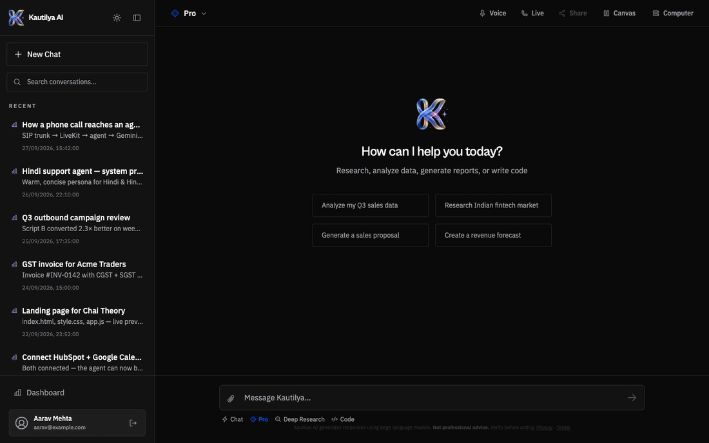
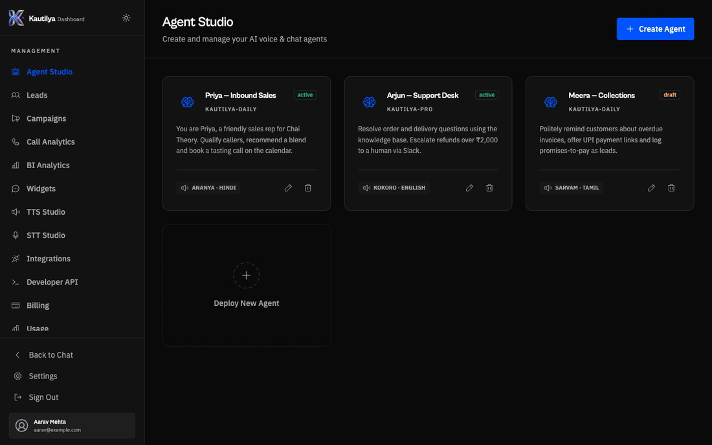

# Features

A tour of what Kautilya does, where to find each feature in the UI, and what powers it.

## Chat

The chat is the heart of Kautilya. The composer has four modes:

| Mode | What it does |
|---|---|
| **Chat** | Kautilya Daily (Gemini Flash) for everyday requests. Coding work is handed to Kautilya Coder automatically. |
| **Pro** | Gemini 3.1 Pro for analysis, planning and long-form writing. Toggle **Max Thinking** for a bigger reasoning budget. |
| **Deep Research** | A cited, multi-round research report. Choose *quick*, *standard* or *exhaustive* depth, or **PRD** mode for a product requirements document. |
| **Code** | Kautilya Coder writes whole multi-file projects into the canvas, keeps editing the same project across turns, and emits only the files that changed. |

**While it answers you see:**

- a live **thinking** trace, collapsed into *Process Analysis* when it's done
- a **ReAct timeline** with one card per tool call (web search, Python, browser, Computer files, integrations), each with a status and preview
- **Truth Lens**: after a pure-knowledge answer, a second model family cross-examines it and shows a verification badge

**What answers can contain:** Markdown tables, LaTeX math, syntax-highlighted code with copy and *open in canvas*, inline **Mermaid diagrams** and **SVG** with zoom and PNG/SVG download, interactive **map cards** and routes, and **question cards**: when the model needs a decision, it asks with clickable options instead of a wall of text.

**Around the conversation:**

- **Attachments:** images (vision), PDFs, Word, Excel/CSV
- **Voice input**, transcribed with Whisper or Nemotron, and **Live** full-duplex voice mode over LiveKit
- **Share:** a public, read-only link to any chat
- **Memory:** Kautilya remembers durable facts about you. Review or clear them in Settings.
- **Personalities:** Kautilya, Rebel, Sunshine, Strategist, Engineer, Professor, Devil's Advocate and Companion, or generate your own
- **Skills:** activatable expert modes, namely Presentation Architect, Frontend Design Engineer, Research & Whitepapers, Diagram Architect and Data Visualizer

## Canvas

The side canvas opens automatically when an answer produces an artifact:

| Artifact | Canvas view |
|---|---|
| Multi-file project | File tree, syntax-highlighted code, **live HTML preview** (React/JSX projects are transpiled in the browser), fullscreen, new tab, ZIP download |
| Document | Rich document with export to PDF and DOCX |
| Spreadsheet / CSV | Sortable table with Excel export |
| Dashboard | Charts built from your data |
| Presentation | Slide deck with image-rich layouts, exportable as a file |

## Kautilya Computer

Each user gets a personal cloud computer that the AI can use:

- **Live browser:** a real headless Chromium (Playwright). The agent can open pages, click, type, scroll, fill forms and log in, and you watch a live CDP screencast in the Computer panel.
- **Files:** the agent can write, read and list files in a per-user workspace, visible in the panel's file browser.

Sessions are per user, capped by `BROWSER_MAX_SESSIONS` and closed after `BROWSER_SESSION_TTL_S` of inactivity.

## Deep Research

Deep Research plans search queries, searches SerpAPI and Tavily in parallel, fetches and reads the sources (respecting per-domain limits), runs follow-up rounds, and synthesises a long report with numbered citations. The report opens in the canvas. Every limit is tunable through the `RESEARCH_*` variables in [configuration.md](configuration.md#model-providers).

## Dashboard

| Page | What it's for |
|---|---|
| **Agent Studio** | Create voice and chat agents: persona prompt, language, voice, model, STT/TTS providers, interruption behaviour, a welcome and fallback line, post-call webhook, call handoff. Includes a knowledge base (files, URLs, site crawl), web test calls and phone test calls. |
| **Leads** | Every lead captured by calls and the website widget, with status and notes |
| **Campaigns** | Upload a CSV, attach an agent, start or pause outbound dialing, watch progress |
| **Call Analytics** | Per-call transcripts, summaries, sentiment and outcomes, plus call-volume trends |
| **BI Analytics** | Interactive business-intelligence dashboards |
| **Widgets** | Generate the embeddable website chat widget for an agent |
| **TTS Studio** | Synthesise speech with RevealIQ (Kokoro), Sarvam (Hindi, English and 7 more Indian languages), Cartesia or ElevenLabs, with streaming playback and WAV download |
| **STT Studio** | Transcribe audio with the self-hosted Nemotron streaming ASR |
| **Integrations** | Connect 59 apps and add custom MCP servers |
| **Developer API** | Create and revoke API keys, with copy-paste examples for Python, Node, cURL and IDE agents |
| **KautilyaClaw** | Set up your personal agent on Telegram or WhatsApp |
| **Billing & Usage** | Razorpay checkout for Pro, pay-as-you-go credits, 14-day usage charts |
| **Settings** | Profile, personality, memory, telephony provider, privacy |

## Business tools

- **GST invoices:** extract line items, compute CGST, SGST and IGST, and generate a compliant invoice PDF (`/api/invoice/*`).
- **Maps:** nearby search and routing, powered by Mappls with an OpenStreetMap fallback.
- **Integrations in chat:** "email this to Rahul", "add a meeting tomorrow at 4", "post the summary to #sales" and similar requests run through connected Gmail, Calendar, Slack, WhatsApp, HubSpot and others.

## Platform

- **OpenAI-compatible API** with `kautilya-daily`, `-pro`, `-coder` and `-fast`, for use in Cline, Cursor, Continue or the OpenAI SDK. See [api.md](api.md).
- **Tiers:** Guest, Free and Pro, with per-minute and daily limits and pay-as-you-go overflow credits
- **Installable PWA** and an Android wrapper hook (`window.AndroidInterface`) for native Google sign-in
- **Email:** welcome mail on first login, and a gentle re-engagement mail after two days of inactivity (at most weekly)
- **Privacy & compliance:** age gate and consent (DPDP Act 2023), data export (`/api/user/my-data`), deletion requests, and a [CERT-In incident runbook](compliance/cert-in-incident-response.md)
