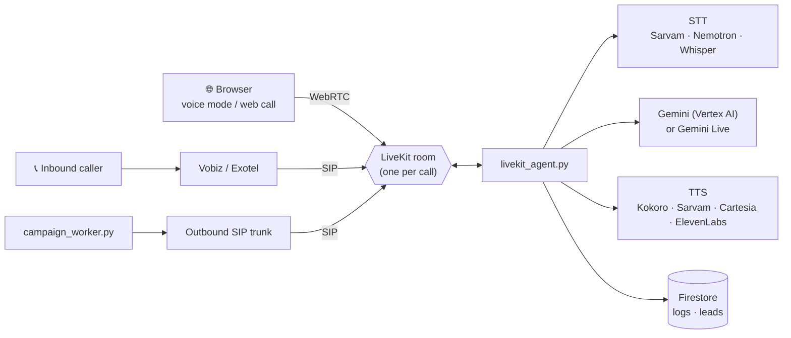

# Voice & telephony

Kautilya agents can talk: in the browser, on a real phone number, or by calling a list of leads. This page covers the realtime voice stack and how to wire each piece.



## 1. LiveKit

1. Create a project on [LiveKit Cloud](https://cloud.livekit.io), or self-host LiveKit.
2. Copy **URL**, **API key** and **API secret** into the backend env:

   ```ini
   LIVEKIT_URL=wss://your-project.livekit.cloud
   LIVEKIT_API_KEY=…
   LIVEKIT_API_SECRET=…
   ```

3. **Voice mode in chat** and **web calls in Agent Studio** now work. The frontend asks `POST /api/agents/<id>/livekit-token` for a room token and joins with `livekit-client`.

## 2. The voice agent worker

`backend/livekit_agent.py` is a [LiveKit Agents](https://docs.livekit.io/agents) worker. It joins each room, loads the agent's configuration from Firestore (by room name, or by the dialled number for SIP calls), and runs the conversation loop:

- **VAD:** Silero, prewarmed once per process
- **STT:** Sarvam by default. Self-hosted Nemotron or Groq Whisper are also available.
- **LLM:** Gemini on Vertex AI (Flash-Lite for low latency), or **Gemini Live** end-to-end (`GEMINI_LIVE_MODEL`), with a Groq Llama fallback
- **TTS:** the agent's `tts_provider`: `revealiq` (self-hosted Kokoro), `sarvam` (Bulbul), `cartesia` or `elevenlabs`
- **Turn-taking:** barge-in, silence handling and a configurable fallback line

Run it next to the backend, with the same environment:

```bash
cd backend
python livekit_agent.py start      # or: sh start_worker.sh  (two self-restarting workers)
```

| Variable | Purpose |
|---|---|
| `LIVEKIT_AGENT_NAME` | Register under a name for explicit dispatch |
| `LIVEKIT_NUM_IDLE` | Warm processes kept ready (default 2). Raise it for call bursts. |

## 3. Phone numbers (SIP)

Inbound calls reach LiveKit through a SIP trunk from an Indian telephony provider.

### Inbound with Vobiz

1. In LiveKit Cloud, open **Telephony → SIP** and note your project's **SIP domain** (for example `abc123.sip.livekit.cloud`). Set it as `LIVEKIT_SIP_URI`.

   > [!NOTE]
   > The SIP domain is *not* the same host as `LIVEKIT_URL`, so don't derive one from the other.

2. Set `WEBHOOK_SECRET` to a random string. It's appended to the provider webhook URLs.
3. In **Dashboard → Agent Studio**, open an agent and copy its inbound URLs. They come from `GET /api/telephony/inbound-url/<agent_id>`:
   - **Answer URL:** `https://<backend>/api/webhooks/vobiz/answer/<agent_id>?secret=…` (method `POST`)
   - **Events URL:** `https://<backend>/api/webhooks/vobiz/events?secret=…`
4. Paste both into the Vobiz portal against your virtual number. When someone calls, Vobiz hits the answer webhook, the backend bridges the call into LiveKit SIP, and the mapped agent picks up.

Exotel works the same way through `/api/webhooks/exotel/answer/<agent_id>` and `/api/webhooks/exotel/events`.

Run `GET /api/telephony/diagnostic` to check that every required variable is set.

### Outbound

- Set `LIVEKIT_OUTBOUND_TRUNK_ID` to an outbound SIP trunk configured in LiveKit.
- Single calls: `POST /api/telephony/outbound-call`, or **Test call** in Agent Studio. Test calls use the `VOBIZ_MASTER_*` account.
- Free-tier users get `FREE_OUTBOUND_CALL_LIMIT` calls (default 5).

## 4. Campaigns (bulk outbound dialer)

1. Upload a CSV of leads: `POST /api/campaigns/upload`, or **Dashboard → Campaigns**.
2. Create a campaign for an agent: `POST /api/campaigns/create`.
3. Start it: `POST /api/campaigns/<id>/start`.

`campaign_worker.py`, launched by `start.sh`, polls for running campaigns and dials with bounded concurrency:

| Variable | Meaning |
|---|---|
| `CAMPAIGN_CONCURRENCY` | Simultaneous calls per campaign (default 3) |
| `CAMPAIGN_GLOBAL_MAX` | Cap across all campaigns |
| `CAMPAIGN_DIAL_PACING` | Delay between dials |
| `CAMPAIGN_POLL_INTERVAL` | How often the worker checks for work |

Every call ends with a transcript, summary, sentiment and lead record in Firestore, visible in **Leads** and **Call Analytics**. The agent's `post_call_webhook` receives the same data.

## 5. Speech engines you can host yourself

Two small FastAPI services ship in this repo. Both run on a free CPU Hugging Face Space.

### Kokoro TTS: [`RevealIQ ASR models/`](../RevealIQ%20ASR%20models)

- English (`kokoro-en`) and Hindi (`kokoro-hi`) voices from [Kokoro-82M](https://huggingface.co/hexgrad/Kokoro-82M)
- OpenAI-compatible `POST /v1/audio/speech`, plus `POST /v1/audio/stream` for low-latency PCM
- Point the backend at it with `REVEALIQ_TTS_URL`. Set `REVEALIQ_HF_TOKEN` if the Space is private.

### Nemotron STT: [`voicerecog/`](../voicerecog)

- NVIDIA [`nemotron-3.5-asr-streaming-0.6b`](https://huggingface.co/nvidia) as ONNX INT4, faster than real time on CPU
- OpenAI-compatible `POST /v1/audio/transcriptions`
- Powers **STT Studio**. Point the backend at it with `STT_SPACE_BASE`.

Deploy either one as a Docker Space: create a Space with the **Docker** SDK and push the folder. The README front-matter is already set.

## 6. Voice Studio & STT Studio

**Dashboard → TTS Studio** synthesises text with any configured engine: RevealIQ (Kokoro), Sarvam in Hindi, English and 7 more Indian languages, Cartesia, or ElevenLabs. It supports streaming playback and WAV download. **STT Studio** transcribes uploads or microphone audio through the Nemotron engine.
